# Residency Explorer Local

**residency-explorer-local** is a locally hosted web app that simplifies
managing data about medical residency programs in the US, aiding prospective
residents in making informed decisions during the Residency Match process.

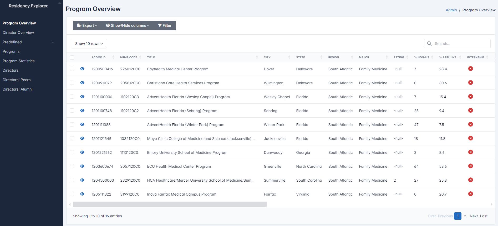
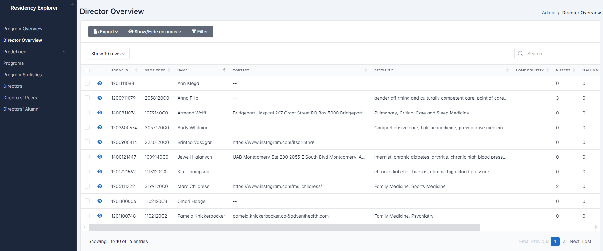

## Features

- **User-Friendly Data Entry**: Easily input information about medical
  residency programs through intuitive forms.
  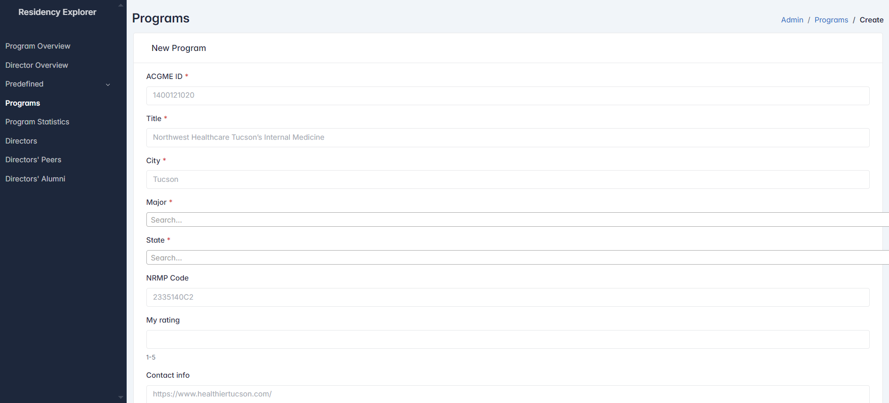
  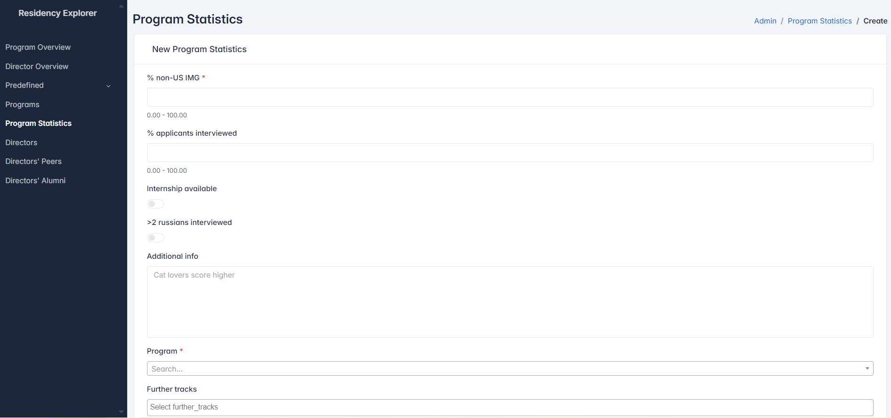
  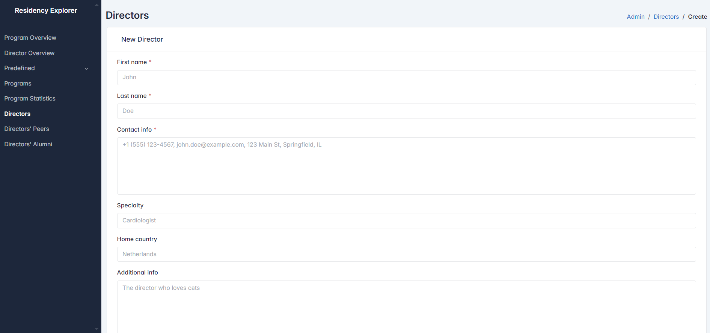

- **Table View**: Data is presented in well-organized tables, making it easy
  to review and manage.
  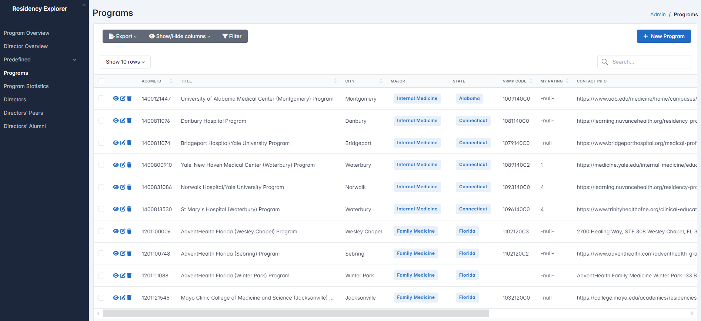
  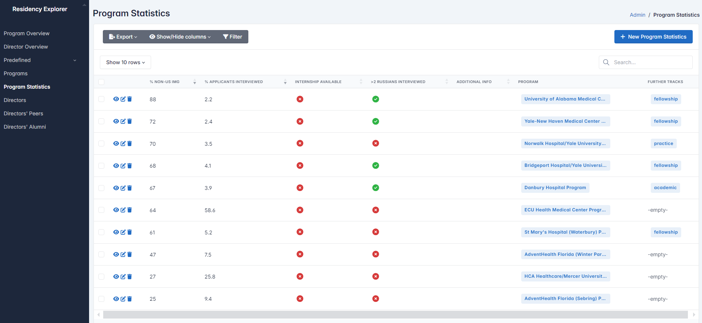
  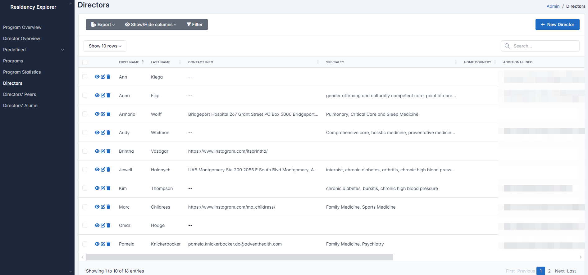
  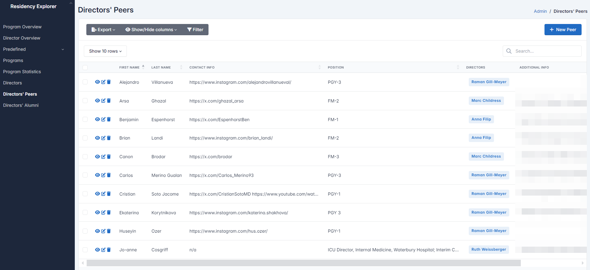

- **Instant Filtering and Sorting**: Real-time data filtering and sorting
  within tables, no page reload needed.
  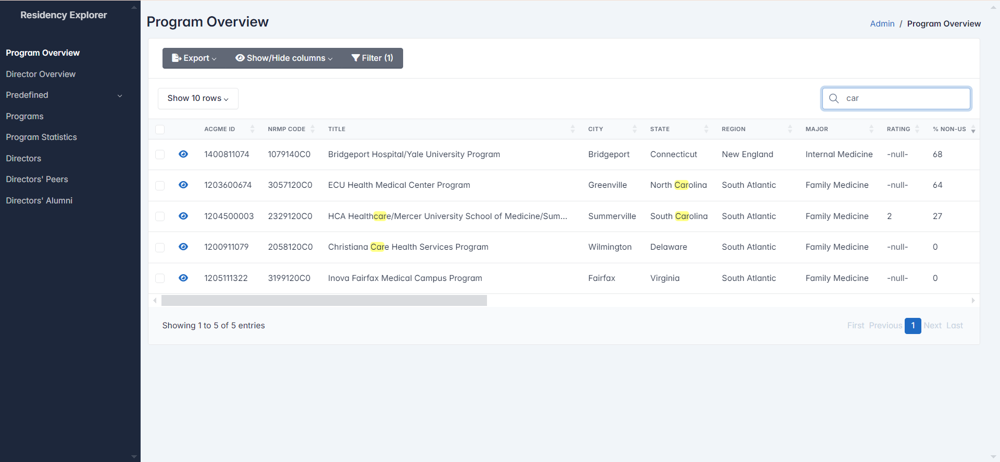
  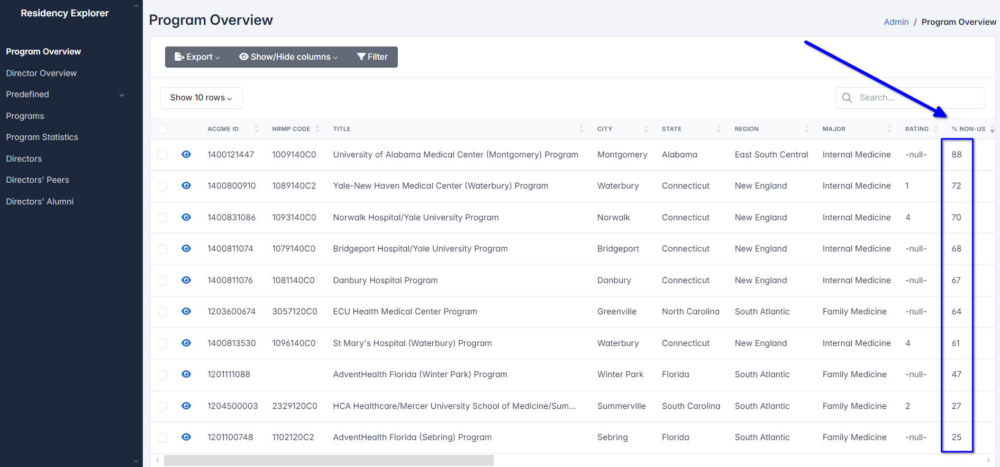

## Installation and Setup (for Windows users)

1. Install [Docker Desktop](https://www.docker.com/products/docker-desktop/).
2. Generate the `.env` file. This step is required only once during the
   installation.

   2.1. Open `PowerShell`

   2.2. Navigate to the root directory of the project

   2.3. Run
      ```bash
      python ./scripts/generate_dotenv/dotenv_from_toml.py
      ```

   > Unfortunately, you will need to figure out how to install Python if you don't have it already.

   > Alternatively, you can use **an unsafe method**: simply rename `.env.example` to `.env` in the root directory of
   the project.

## Running the Application (for Windows users)

### First-Time Launch

1. Ensure the `.env` file is present in the root directory of the project.
2. From the root of the project, open PowerShell and run the following command:

```bash
docker compose up --build
```

This will build and start the application. Once the application is ready,
you will be prompted to visit [0.0.0.0:8888](http://0.0.0.0:8888) in your browser.

### Subsequent Launches

After the first launch, you can start and manage the application directly
from `Docker Desktop`.

Open `Docker Desktop` and navigate to the `Containers` section.
You will find a shortcut to start the application under the
`residency-explorer-local` container.
After starting the container, you can click on the link labeled `8888:8888`
to open the application in your browser.
**It is recommended to stop** the application in `Docker Desktop` when
you're done using it to free up system resources.


## How to Use

1. Create a Program in the `Programs` Section.
2. Once a Program is created, you can add associated statistics in the `Program statistics`
   section and assign a director in the `Directors` section.
3. After a director is added, you can further enrich the data by adding peers (colleagues)
   in the `Directors' Peers` section and alumni in the `Directors' Alumni` section.

### **Q: Why this order?**

> **A:** Adding a director without a program, or peers without a director, is meaningless because these relationships
> are required for the data to be relevant and connected.

Summary information about the programs will be displayed in the `Program Overview`, and summary information about
directors will be available in the `Director Overview`. These are convenient tables for searching and sorting
information.

**Each table can be exported to CSV, Excel, or PDF.** For the highest quality PDF export, it is recommended to use
the `Print` option and save as PDF.

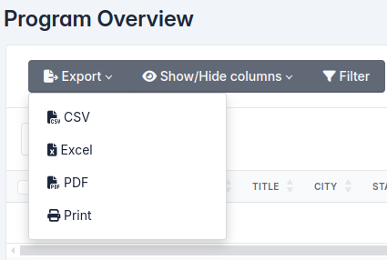

The `Predefined` tab contains pre-filled auxiliary tables. You can edit these tables as needed. However, it is
recommended not to delete rows that are linked to other tables, as this may cause those linked entries to be deleted as
well.

## For Developers

### Stack

#### Backend:

- `Python 3.12`: Core programming language for the app.
- `Uvicorn`: ASGI server for running the app.

#### Database:

- `PostgreSQL`: Relational database for data storage.
- `SQLAlchemy`: ORM for database interactions.
- `Psycopg2`: Synchronous PostgreSQL adapter for Python.

> Because `starlette-admin` seem not to support async engines

- `Alembic`: Database migrations tool for SQLAlchemy.

#### Data Management:

- `Pydantic`: Data validation and type checking.
- `Pydantic-Settings`: Handling of env variables and settings.
- `Rtoml`: TOML configuration file parser.

#### Admin Interface:

- [`Starlette-admin`](https://github.com/jowilf/starlette-admin): Provides a web interface for managing the database.

### Database schema

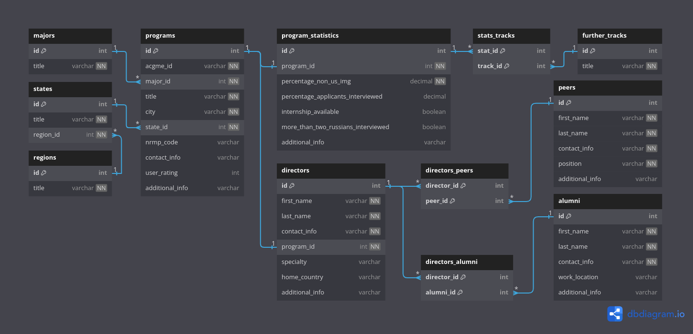
This diagram was created using [dbdiagram.io](https://dbdiagram.io).
The database schema code is available in the `./docs/database_schema.dbml`
file.

### Customization

The primary configuration file for the application is `config.toml`.
After making any changes to this file, you must generate a new `.env` file.
This can be done using

```bash
python ./scripts/generate_dotenv/dotenv_from_toml.py
```

Alternatively, you can use the following `Makefile` command to generate the `.env` file:

```bash
make dotenv
```

It's important to ensure that the `.env` file is correct, as only with
a properly configured `.env` will the

```bash
docker compose up --build
``` 

function correctly. 
